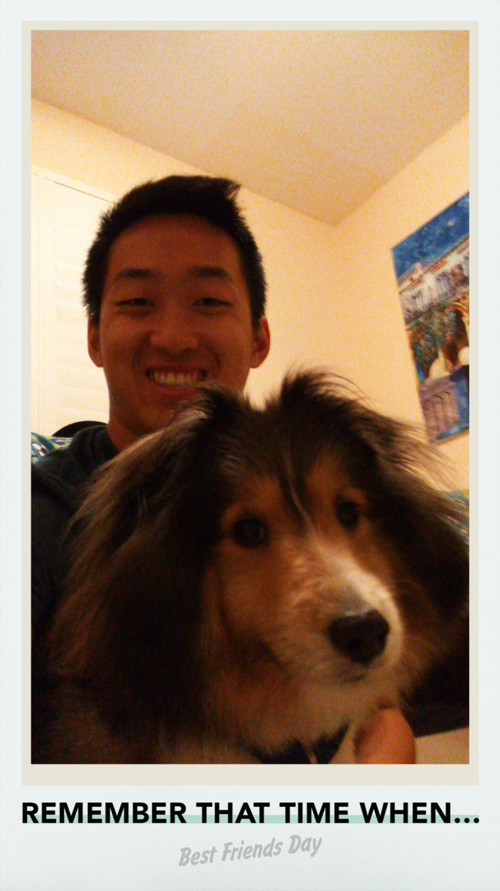

The plan for the next few blog posts will be about the summer that just passed and some of the highlights I had while working and travelling. I'm hoping this will allow me to get in the habit of posting blogs on a more regular basis and since I'm currently studying for midterms and doing assignments for school, there isn't much to talk about right now.  
To get started, over the summer I worked as a Software Engineering Intern at a start-up called [Zanbato](https://zanbato.com/) in Mountain View, California. This was my first time leaving my home country, Canada, and living by myself. Without a doubt, this was the best summer I've had so far. I travelled to many places I never expected to go to and met a lot of smart and interesting people as well! Also, as someone who is studying and pursuing a job in tech, being able to work in Silicon Valley is a dream come true.  
Working at Zanbato was definitely eye opening and has allowed me to grow more than I expected. I flew out of YYZ the morning of April 29 and landed in SFO... that same morning. Wow, that time difference though. My boss then picked me up and drove me to my place in Mountain View and took me out to eat for lunch where I was able to expereince my first Californian Mexican food! I have to say, the Mexican food in Cali taste so much better than what we have in Toronto. After, he showed me around Mountain View for a bit before dropping me back off at my house. That is when I met the cute little devil alarm clock named Noah. 
{:height="50%" width="50%"} 
 
Being with Noah was always a fun time, excluding him waking me up at 6 am everyday. I lived in a nice house with the land lady and another intern. Both of them were very kind and fun to be with. When I first arrived, they helped me get a better understanding of the Bay area and helped me settle in. Honestly, living with them felt like I was living with my family back in Canada. We usually went out to eat as a "family" once a week which was fun. Since the other intern and I were both new to California, we would try to go out and explore every weekend.   
Work at Zanbato was also extremely fun as well! The company is still a start-up so they only have a handful of engineers inside of their headquarters. Even though there aren't many there, they are all people I look up to as role models and aim to be in the future. They are all extremely talented and being with them every day was always fun. Most people dread the thought of going into work five days a week from 9-5, however, it was different for me. I never thought a single day of work was actually work. I enjoyed my time there and it felt more like I was working on a side project than a work project, mainly because I was working on and learning things that interested me. Also, we played Smash 4 and ping pong everyday LOL. I'm not trying to say the work at Zanbato is easy and that we just play games all day. The work there is difficult and they are building a wonderful product. But when you are passionate about the product you are building, work becomes much more enjoyable. Another thing I loved about Zanbato is that my co-workers are all into sports. So, almost every Friday after work we went to a public park, close by to the office, to play basketball, frisbee or sand volleyball. I will miss my time at Zanbato but if I have the chance, I will definitely go back and visit them. I wish all the best to Zanbato, as a company, and all of those that I met while I was there!
